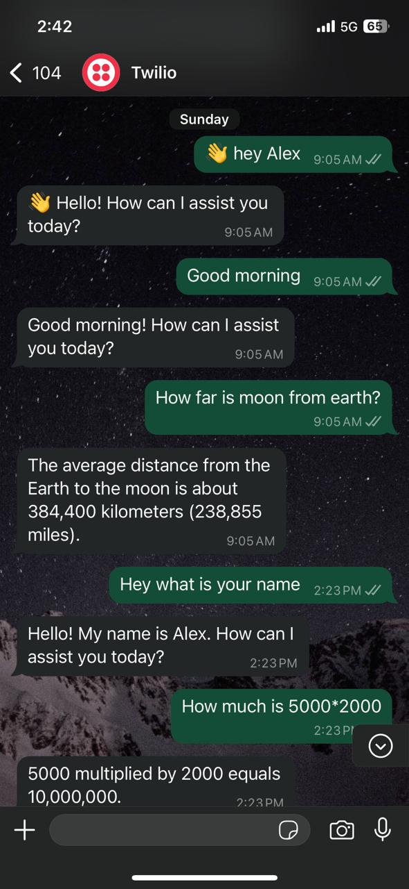

# WhatsApp GPT-3.5 Turbo Chatbot

🚀 A WhatsApp chatbot powered by **GPT-3.5 Turbo**, using **Twilio** for WhatsApp messaging and deployed on **Heroku**.

---

## 📸 Screenshot


---

## 🛠 Features
- 🤖 AI-powered chatbot using OpenAI's **GPT-3.5 Turbo**.
- 📲 Integrated with **WhatsApp** via **Twilio API**.
- ☁️ Deployed on **Heroku** for seamless cloud hosting.
- 🔄 Supports **natural language conversation**.

---

## 🚀 Deployment

### 1️⃣ Prerequisites
- OpenAI API Key
- Twilio Account with WhatsApp Sandbox setup
- Heroku CLI (for deployment)

### 2️⃣ Installation
```bash
# Clone the repository
git clone https://github.com/Bharanidharan7708/Whatsapp_GPT.git
cd Whatsapp_GPT

# Install dependencies
pip install -r requirements.txt
```

### 3️⃣ Environment Variables
Create a `.env` file and add:
```ini
OPENAI_API_KEY=your_openai_api_key
TWILIO_ACCOUNT_SID=your_twilio_account_sid
TWILIO_AUTH_TOKEN=your_twilio_auth_token
TWILIO_WHATSAPP_NUMBER=whatsapp:+14155238886
MY_WHATSAPP_NUMBER=whatsapp:+your_number
```

### 4️⃣ Run Locally
```bash
python app.py
```

### 5️⃣ Deploy to Heroku
```bash
heroku login
heroku create your-app-name
git push heroku main
```

---

## 🎯 Usage
1. Save the **Twilio WhatsApp sandbox number** in your phone.
2. Send `Hello` to start chatting.
3. The bot will respond using **GPT-3.5 Turbo**.

---

## 📜 License
This project is licensed under the **MIT License**.

---

## 🤝 Contributions
Feel free to fork, modify, and contribute! PRs are welcome. 😊